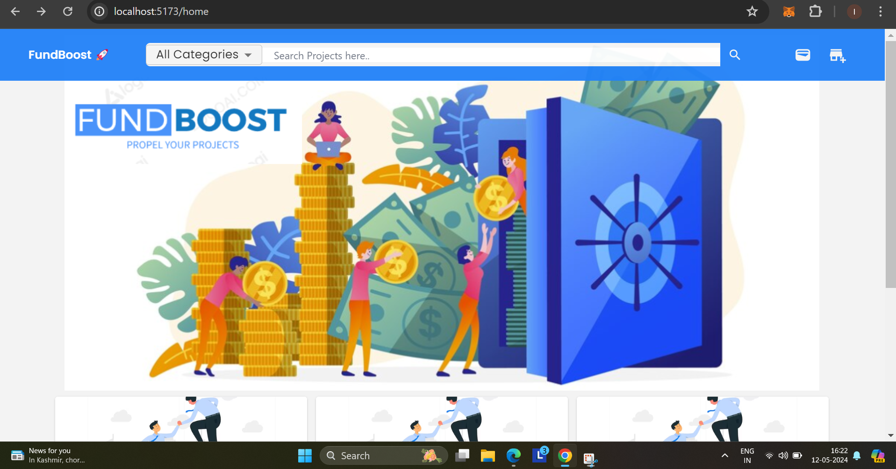

# FundBoost : dapp-capitalRaising-crowdFunding

The project has three main directories:
d-app-client 
server
contracts

HomePage screenshot

Projects Cards : 

Create New Campaign Modal

#

Campaign Details Page : 

How to Start the Project 

`git clone` the repository from [Github](https://github.com/imrann2005/dapp-capitalRaising-crowdFunding)

Then navigate to `cd./d-app-client`

And then run `npm install` to get necessary dependencies

Finally run `npm run dev` to start the development server